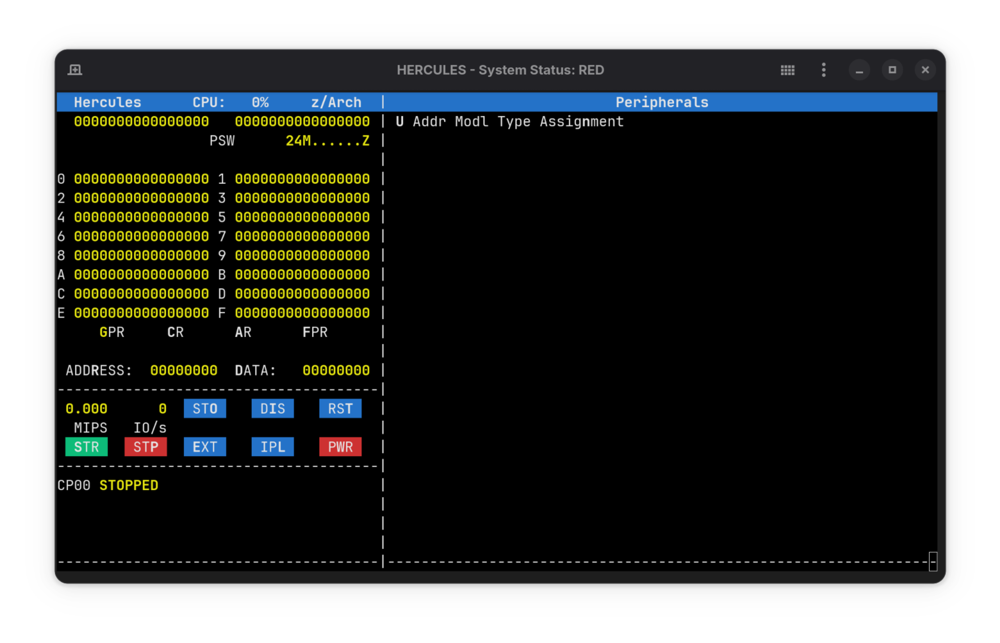

# Hercules Docker

A simple docker image shipping the hercules emulator allowing you to emulate operating systems like MVS on any system you like _(yes you can turn your raspberry pi into a mainframe)_.



## Running

The image is shipped for amd64 and aarch64 architectures. The default entrypoint is the `hercules` command so you can spin up the emulator with:

```bash
docker run --rm -i -t ghcr.io/steveiliop56/hercules-docker:v0.1.0
```

Ideally you would want to create a volume holding your opearing system install (for example MVS) which can be done with:

```bash
docker run --rm -i -t -v ./my-mvs-install:/hercules ghcr.io/steveiliop56/hercules-docker:v0.1.0 -f conf/mvs.cnf
```

> [!TIP]
> By default the Dockerfile creates a `/hercules` directory and sets it as the working directory making it easier to run your OS using relative paths.

## Building

If you like you can build the docker image using:

```bash
docker buildx build --progress=plain -t my-username/hercules-docker .
```

## Contributing

If you face an issue or have a suggestion on how to improve the image, feel free to create an [issue](https://github.com/steveiliop56/hercules-docker/issues) or a [pull request](https://github.com/steveiliop56/hercules-docker/issues). Any contributions are welcome!

## License

Hercules docker is licensed under the MIT License. TL;DR — You can use, copy, modify, merge, publish, distribute, sublicense, and/or sell copies of the software. Just make sure to include the original license in any substantial portions of the code. There’s no warranty — use at your own risk. See the [LICENSE](./LICENSE) file for full details.
